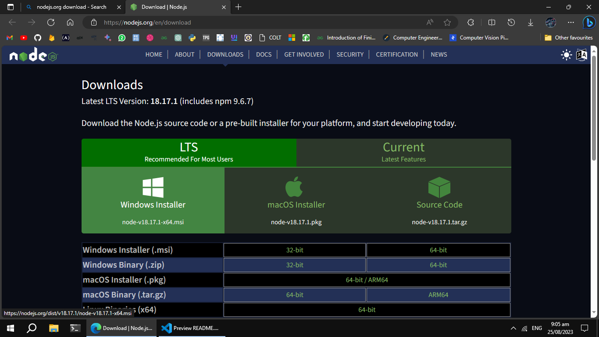
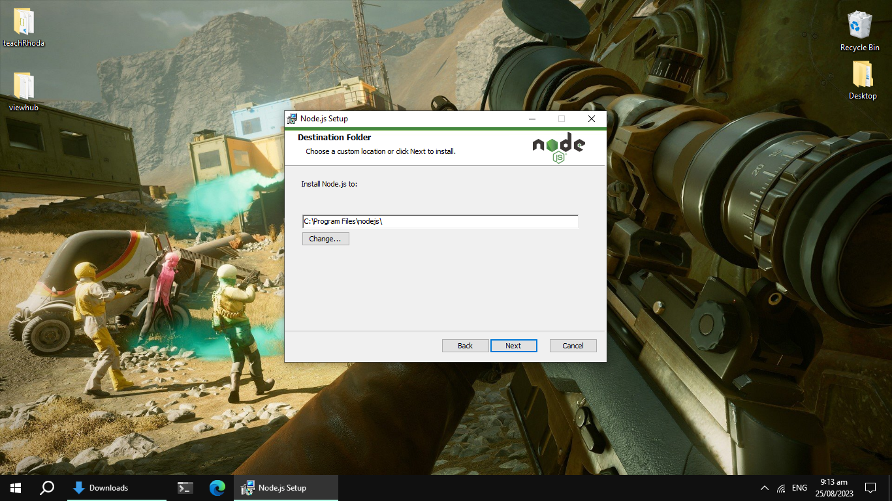
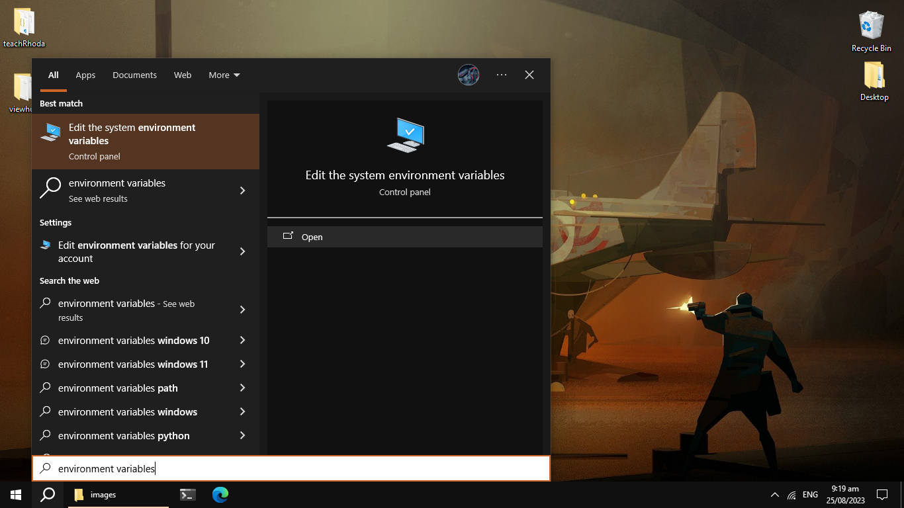
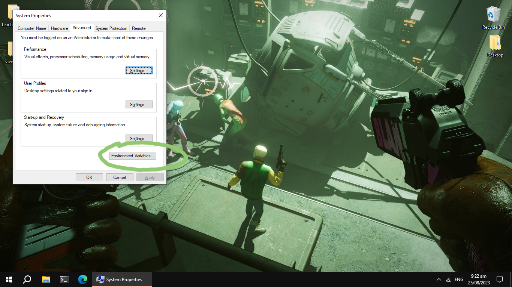
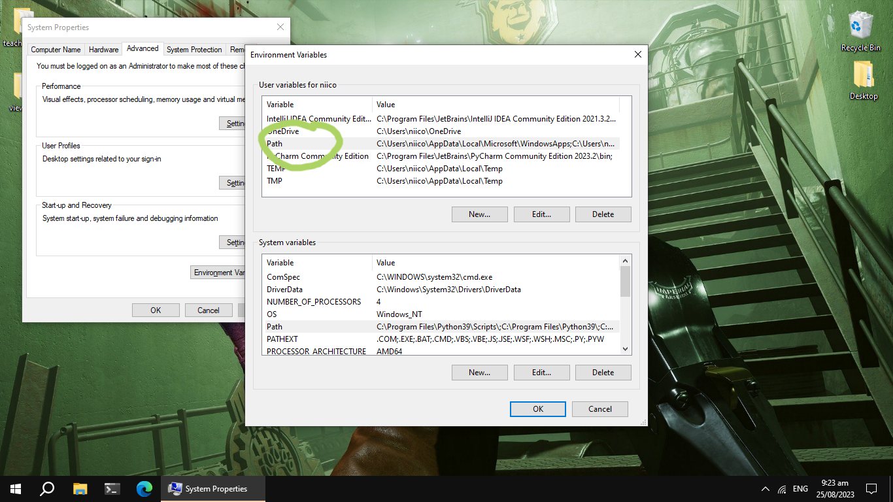
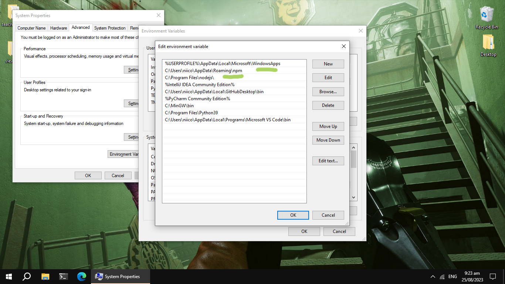
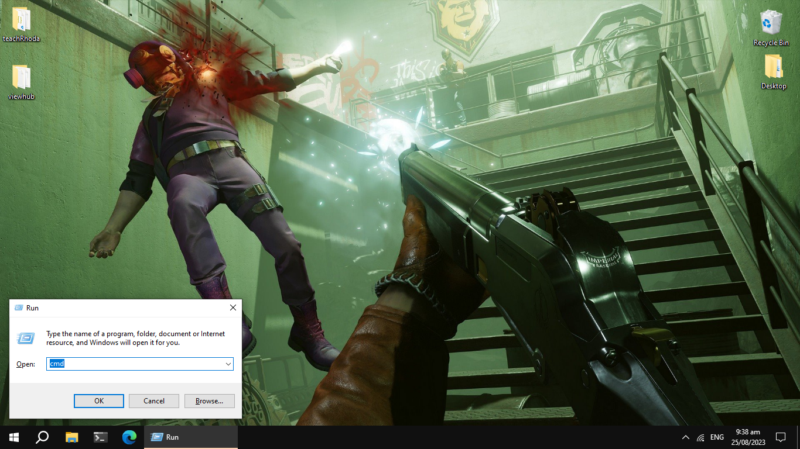
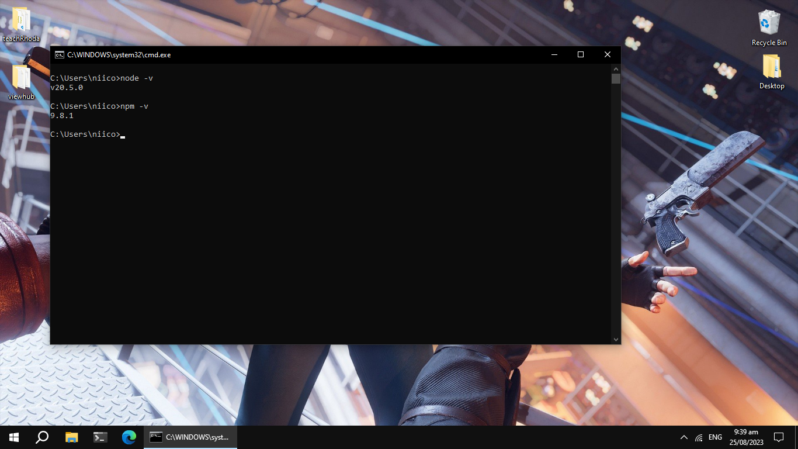

# Rhoda Learns Git

Introduction goes here // TODO

## __Getting started__
### Install nodejs from the link below
* ***[Click Here](https://www.nodejs.org/en/download)*** to download nodeJS
* You should see this page:
* 
* click on the ***Windows Installer*** to download it
* Open the installer to install node on your system
* 
* Take note of the install directory as you will need to add node to your environment variables
* open up search using ___WINDOWS+S___ then type ***environment variables*** then click on ***Edit System Environment Variables***
* 
* Select ___Environment Variables___ in the window
* 
* Select Path 

* add the path for both node and npm
* 
* open up command prompt ___WINDOWS+R___ then type ***cmd***
* 
* type the following commands to check the version of node and npm to confirm that it has been installed correctly and added to your path
* to check node version

```bash
node -v
```
* to check npm version
```bash
npm -v
```
* 


### Cloning this repository
